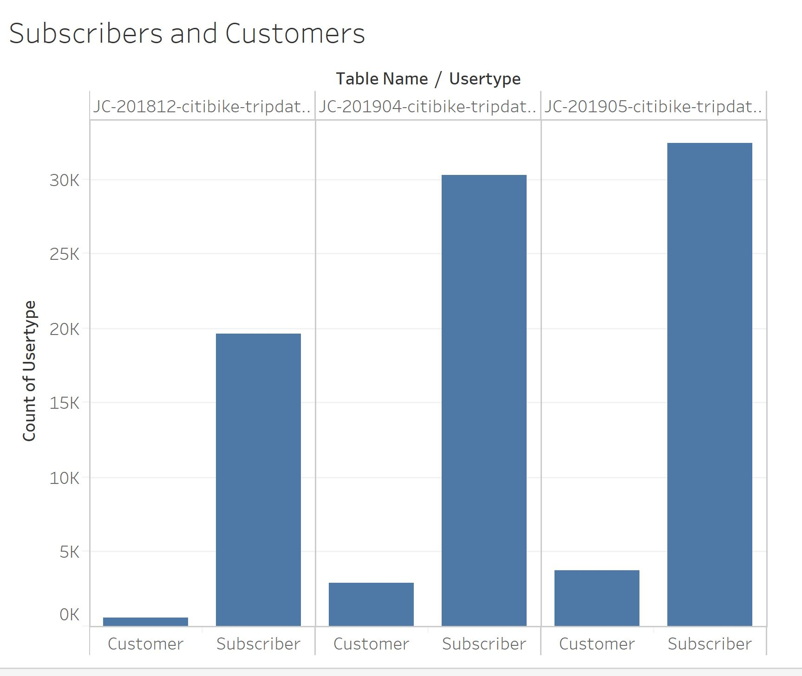
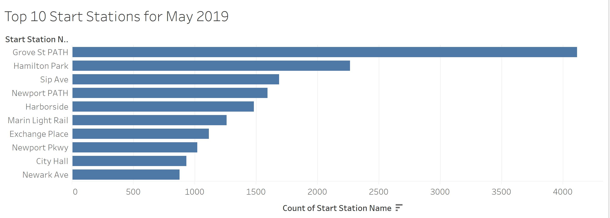
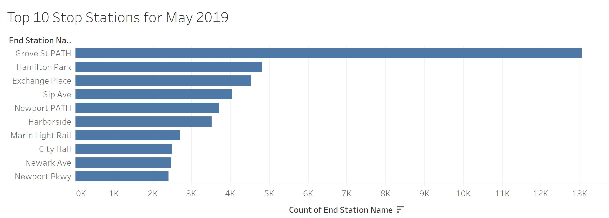
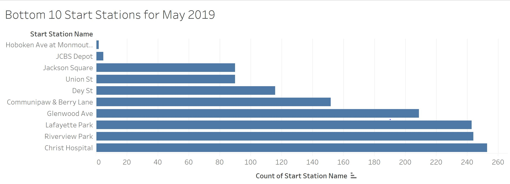
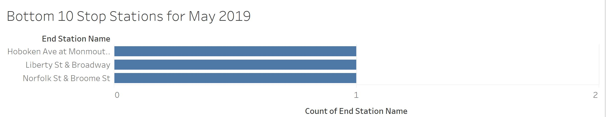
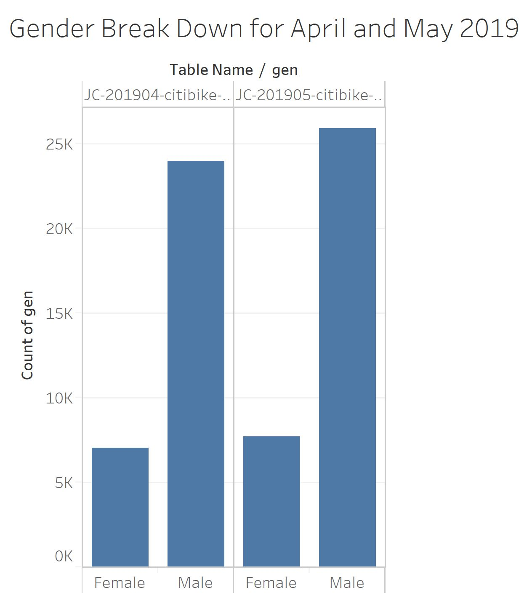
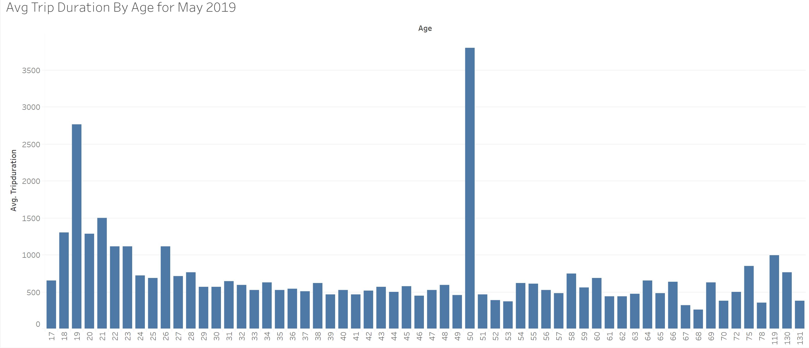

# citibike-bi
The time span that is used for this data set is between April and May 2019.  There is also data from December 2018 to compare the number of uses between winter and summer.

# Analysis
1. How many trips have been recorded total during the chosen period?
   *  During the period of April and May, there were a total of 69,191 trips recorded.
2. By what percentage has total ridership grown?
    * Between the months of April and May of this year, ridership has grown 9.314%.
3. How has the proportion of short-term customers and annual subscribers changed?

1. What are the top and bottom 10 stations in the city for starting and ending a journey?
    1. Top 10 Start Locations 
    
    1. Top 10 End Locations
    
    1. Bottom 10 Start Locations
    
    1. Bottom 10 End Locations
    
* Each of these charts were created by using sets.  The most popular start and stop locations are the same (with the ordering being a little different).  This seems to be because these locations are near popular locations that get alot of human traffic, such as the city hall and PATH stations.  The bottom 10 locations are all in more local streets that doesn't have nearly as much human traffic.
5. What is the gender breakdown of active participants (Male v. Female)?

* Between the period of April and May, the number of female and male participants has risen from 
6. How effective has gender outreach been in increasing female ridership over the timespan?
7. How does the average trip duration change by age?

