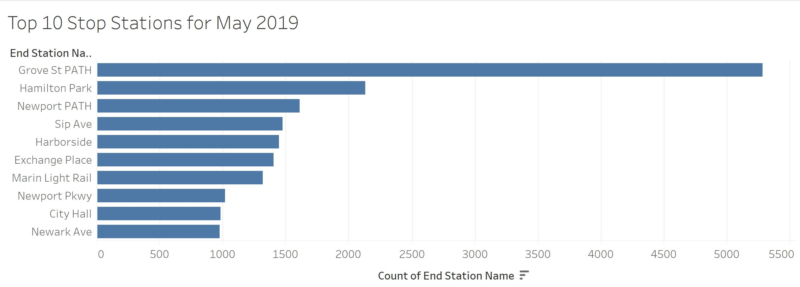

# citibike-bi
The time span that is used for this data set is between April and May 2019.  There is also data from December 2018 to compare the number of uses between winter and summer.

# Analysis
1. How many trips have been recorded total during the chosen period?
   *  During the period of April and May, there were a total of 69,191 trips recorded.
2. By what percentage has total ridership grown?
   * Between the months of April and May of this year, ridership has grown 9.314%.
3. How has the proportion of short-term customers and annual subscribers changed?

    * In December 2018, there were 33.18 times as many subscribers as short-term customers, in April 2019 there were 10.61 times as many subscribers as short-term customers, and in May 2019 there were 8.58 times as many.  There has been a slowly decreasing gap between the number of short-term customers and the number of subscribers.
4. What are the top and bottom 10 stations in the city for starting and ending a journey?
    1. Top 10 Start Locations 
    
    2. Top 10 End Locations
    
    3. Bottom 10 Start Locations
    
    4. Bottom 10 End Locations
    
* Each of these charts were created by using sets.  The most popular start and stop locations are the same (with the ordering being a little different).  This seems to be because these locations are near popular locations that get alot of human traffic, such as the city hall and PATH stations.  The bottom 10 locations are all in more local streets that doesn't have nearly as much human traffic.
5. What is the gender breakdown of active participants (Male v. Female)?

6. How effective has gender outreach been in increasing female ridership over the timespan?
   * Number of female riders has increased from 6996 to 7703 riders between April to May.  The number of male riders has also increased during this time span as well from 23964 riders to 25846.  There were 3.45 times as many males as females in April and 3.36 times as many males as females in May.  This is not that significant of a change between these months and more should be done to get female riders.
7. How does the average trip duration change by age?

* The ages for each user was done by subtracting the current year (2019) from the birth year colum that was provided in this dataset.  While this calculation is not totally accurate, it will provide accuracy within one year.  It needs to be made clear that conclusions are going to be tough to make for which ages use the bikes the most.  While the data says that people of the age 19 rode the bikes for 2765 seconds and people of the age 50 rode the bikes for 3797 seconds, there are also people who are supposedly 119, 130, and 131 years old in this dataset.  This makes it clear that some users have lied about their age, as it is rather unbelievable that people of this age use this service at all.  These ages should be ignored and not considered at all.
8. What is the average distance a bike is ridden?
   * The average distance a bike was ridden in the month of May was 0.6092 miles.

